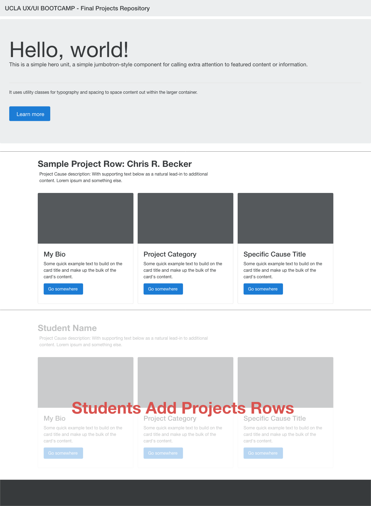

# UX-UI-Final-Projects

A class repository to practice adding branches and contributing to include their work.

**Instructions**

1. Github: Clone the Repo 

    - If you have not been added as a collaborator in github send github user name to instructor.

2. GitKraken: Pull down changes

3. GitKraken: Create a Branch
    - Branch name (first-lastname-causeName)

4. VS Code: Add a Project Row to the HTML page. 

   - Add a Row.
   - Add 3 cards.
     - Card 1: Project Author - add your image.
     - Card 2: Project Category - add your category + image.
     - Card 3: Project Cause - add your specific cause + image.
   - Add an image to your card for your cause (website)
   - Add a link to the cause.  

5. GitKraken: Commit your Project Card.

6. GitKraken: Push your branch changes.

7. GitKraken: Create a Pull Request (PR) to GitHub.

8. GitKraken: Request review from 1 classmate and a TA/Instructor.

9. GitHub: Check PR has been submitted. 

10. GitKraken: Pull down merged changes.

## Student Project Page Wireframe

### Bonus 

- QA and comment on fellow student PR's.

- Add your feedback and approve content.

---

### Copyright

Trilogy Education Services © 2018. All Rights Reserved.
